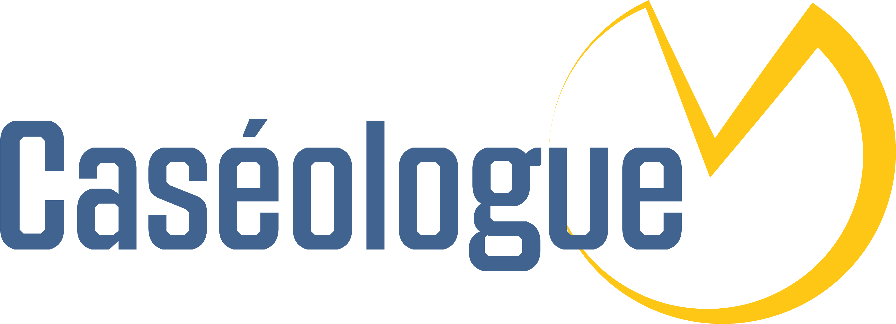

# Caséologue

**Caséologue** is a set of validation tools used to ensure the syntactic correctness and consistency, and semantic coherence of the EDAM ontology, its extensions, and possibly other "EDAM-like" ontologies.

Caséologue uses the [ROBOT](http://robot.obolibrary.org/) tool, running both standard and custom queries, as well as a custom Python script for additional checks. All these checks are orchestrated and usable as GitHub Actions. Detailed documentation is available on https://edamontology.github.io/caseologue.
