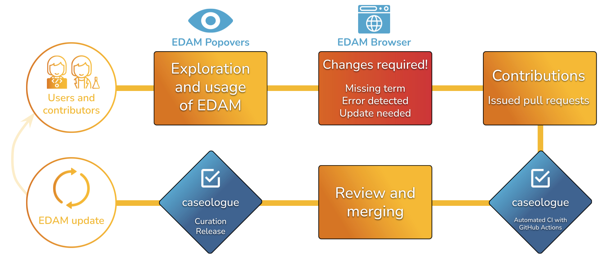

# Summary

EDAM is a domain ontology of data analysis and data management in life sciences. It comprises concepts related to analysis, modeling, optimization, and data life-cycle, and is divided into 4 main sections: topics, operations, data, and formats. 
Thanks to the annotations with EDAM, tools, workflows, standards, data, and learning materials are easier to find, compare, choose, and integrate. EDAM contributes to open science by allowing semantic annotation of research products, thus making them more understandable, findable, and comparable. 

EDAM is developed in a participatory and transparent fashion, within a broad and growing community of contributors. This development model, based on the contribution of a large number of scientific experts, therefore comes with its own set of challenges [@lamothe_2022_7040439]. 

To streamline and accelerate the evolution of EDAM, we have developed and integrated a set of tools that automate the quality control and release process for the ontology, Caseologue. In addition to ensuring the global consistency of EDAM, it enforces edition best practices both at the syntactic and semantic levels. These tools have been integrated in a continuous integration (CI) pipeline, automated using GitHub Actions in the source-code repository. 

# Technical components

Caseologue is a tool suite that comprises: 

  - A custom version of the ROBOT [@jackson2019robot] report query tool.
  - ELK ontology reasoner [@kazakovincredible] called using the robot reason command.
  - A in house developed python script to complement the above tools and further test the EDAM ontology with tailored quality checks.

### Robot report

Robot report function is a generic ontology quality control tool. This tool is calling a customizable list of SPARQL queries fit for EDAM that ensure basic requirements for all ontologies following the OBO guidelines (e.g. presence of a licence, no more than one label in a entity). Some of these queries were modified to fit the EDAM properties declaration.

### ELK

ELK is an reasonner that validate the semantic consistency of the EDAM ontology by inferring logical consequences from the ontology axioms. I it run on EDAM using the ROBOT reason tool. 

### Caseologue custom pyhton script

This custom python script complements the tests performed by the ELK reasoner and the ROBOT report tool. It allows us to test for specific features of the EDAM ontology (e.g. check for wikipedia links or for mandatory properties). All test are divided in 3 severity levels: error, essential and curation. 

**Error**: tests validating the semantic and syntactic consistency of the ontology, that are mandatory to pass for a pull request to be merged on the GitHub repository.

**Essential**: tests that can be applicable to other side of the EDAM ontology such as EDAM geo [@lamothe_2022_7040439] of EDAM bioimaging [@kalavs2020edam], also mandatory for pull request merge.

**Curation**: unmandatory tests, ran by maintainers, that, if failed, do not compromise the integrity or the logical structure of the ontology. The error level is also a staging area for tests that should be error or essential but still raise errors needing to be fixed.

All tests can easily be changed from severety level if needed depending on strategic choices for the ontology.

This custom caseologue python script will, by default, run all tests but can optionnaly only run the test with the needed severity level. 

Almost all tests are calling a custom SPARQL query are query the input EDAM ontology owl file using the RDFlib library [@gunnar_aastrand_grimnes_2022_6845246] and return the results in a user friendly table.

Description of all tests is available in our [documentation](https://edamontology.github.io/caseologue/).

### Continous Integration

The caseologue suite is implemented in GitHub Actions to run quality checks at each Pull Requests created into the main EDAM Ontology repository. Github Actions workflows can also be run manually when needed from the caseologue and the main edamontology repositories going into the "Actions" tab, selecting the wanted workflow on the left panel, clicking on "Run workflow" above the runs list.

A reusable workflow is available for each test in the caseologue repository. The caseologue_robot_report, caseologue_robot_reason and caseologue_python workflows all take as input a path to an EDAM.owl file. caseologue_python can also take as input the error level options chosen to run the tool (see above).

These reusable workflows can't run on their own, they need to be called by another GitHub Actions yaml file. This "caller" workflow will need to upload the tested EDAM.owl file as an artifact so it can be downloaded and used by the "called" workflow (i.e. caseologue_robot_report, caseologue_robot_reason or caseologue_python).

All tools (ROBOT report, ELK, Caseologue pyhton script) can be run locally using command line. See "Get started" paragraph in our [documentation](https://edamontology.github.io/caseologue/).

# Conclusion

All together these tools ensure the syntactic and semantic consistency of the ontology and allow contributions to be merge much faster and more easily to the EDAM ontology.

For now the custom caseologue python script can run up to 20 tests and more test will be added in the future. 

# Acknowledgements

Alban, Johan? Veit? 

# References
